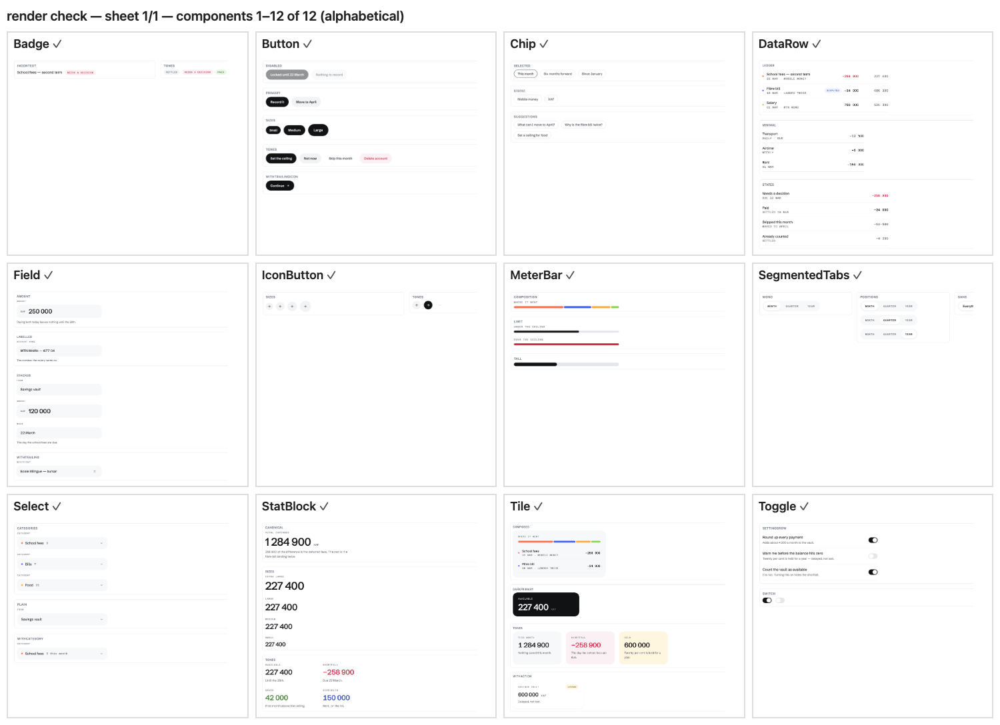

# Ledger

**A calm money design system.** Monochrome ink on paper, mono uppercase labels,
tabular figures, generous space, and colour reserved for data.

Ledger is a small, opinionated component library and token system. It ships three
ways from one source of truth: a plain stylesheet you can drop into any project, a
React component library for the web, and a React Native build for Expo apps.


---

## Table of contents

- [What this is](#what-this-is)
- [Where it came from](#where-it-came-from)
- [Quick start](#quick-start)
  - [Plain HTML / Vue / Django / anything](#1-plain-html--vue--django--anything)
  - [React on the web](#2-react-on-the-web)
  - [React Native / Expo](#3-react-native--expo)
  - [Claude Design / Claude Code](#4-claude-design--claude-code)
- [The components](#the-components)
- [The design tokens](#the-design-tokens)
- [The class vocabulary](#the-class-vocabulary)
- [The design rules](#the-design-rules)
- [How the repo is built](#how-the-repo-is-built)
- [The fidelity contract](#the-fidelity-contract)
- [What changed from the original export](#what-changed-from-the-original-export)
- [Working on it](#working-on-it)
- [Project structure](#project-structure)
- [Known gaps](#known-gaps)
- [FAQ](#faq)
- [Licence](#licence)

---

## What this is

Most design systems are a folder of screenshots and a promise. This one is code you
can install, with the same twelve components available on three different platforms
and a single place where every colour, size and duration is defined.

The core problem it solves is drift. If you write `#111214` in a stylesheet and
`'#111214'` again in a React Native `StyleSheet`, those two values will disagree
within a month. Here, both are generated from one TypeScript file. Change the token,
run the build, and every platform moves together.

**Three things make it worth using:**

1. **One token source of truth.** `src/tokens/*.ts` is authored by hand. Everything
   else — the CSS custom properties, the JavaScript theme object for React Native —
   is generated from it.
2. **Real interaction states.** Hover, press and focus are implemented, in one place,
   according to the spec (background steps one surface, no lift, no scale, a 2px inset
   focus ring rather than the browser outline).
3. **A written design spec.** [`skill/DESIGN.md`](skill/DESIGN.md) explains the voice,
   the colour logic, the type pairing and the spacing rhythm. It answers most questions
   before you ask them, and it is the best thing in this repo.

## Where it came from

Ledger was extracted from the mockups for **Moni**, a personal-finance app for
Cameroon — XAF amounts, mobile money, an on-chain savings vault, and an assistant
called Kima. The visual direction was designed in [Claude Design](https://claude.ai/design)
and exported as a folder of static files.

That export is preserved untouched in [`reference/`](reference/). This repo is what
turns it into something installable: a build, a package, types, tests and a second
platform. The design credit belongs to the original direction; the engineering here
is the packaging around it.

The examples throughout are Moni-flavoured (school fees, mobile money, XAF) because
that is where the system came from and the copy rules only make sense with real
content. The system itself has nothing to do with money — use it for anything that
wants a calm, dense, data-forward surface.

---

## Quick start

### 1. Plain HTML / Vue / Django / anything

No build step, no npm, no JavaScript. Link one stylesheet and write the classes.

```html
<link rel="stylesheet" href="dist/ledger.css">

<div class="led-tile led-tile--dark">
  <div class="led-tile__head">
    <span class="led-tile__label">Available</span>
  </div>
  <div class="led-stat led-stat--l">
    <div class="led-stat__row">
      <span class="led-stat__value">227&thinsp;400</span>
      <span class="led-stat__unit">XAF</span>
    </div>
  </div>
</div>

<button class="led-btn led-btn--solid">Record it</button>
```

Every available class is listed in [`skill/CLASSES.md`](skill/CLASSES.md), which is
**generated from the stylesheet** — so it can never document a class that does not
exist.

### 2. React on the web

```sh
npm install ledger-ds
```

```tsx
import { Tile, StatBlock, Button, DataRow } from 'ledger-ds';
import 'ledger-ds/ledger.css'; // once, at your app root

export function Overview() {
  return (
    <>
      <Tile tone="dark" label="Available">
        <StatBlock size="l" value="227 400" unit="XAF" />
      </Tile>

      <DataRow
        dot="var(--a-coral)"
        name="School fees — second term"
        meta="22 Mar · Mobile money"
        state="alarm"
        amount="−258 900"
        secondary="227 400"
      />

      <Button tone="solid">Record it</Button>
    </>
  );
}
```

The React components are thin wrappers that emit exactly the classes above, so you
can mix components and hand-written markup freely — they cannot drift apart, because
there is only one stylesheet.

> **The stylesheet is not imported for you.** Importing CSS from inside a JavaScript
> module breaks some server-rendering setups and would make the package unusable
> without React. Import it yourself, once.

### 3. React Native / Expo

```sh
npm install ledger-ds
npm install @expo-google-fonts/schibsted-grotesk @expo-google-fonts/azeret-mono expo-font
```

```tsx
import { Tile, StatBlock, Button, theme } from 'ledger-ds/native';
```

**Load the fonts before your first paint.** Without them React Native silently falls
back to the system face, and you lose the tabular figures the whole system depends on:

```tsx
import {
  useFonts,
  SchibstedGrotesk_400Regular,
  SchibstedGrotesk_500Medium,
  SchibstedGrotesk_600SemiBold,
} from '@expo-google-fonts/schibsted-grotesk';
import { AzeretMono_400Regular, AzeretMono_500Medium } from '@expo-google-fonts/azeret-mono';

export default function App() {
  const [ready] = useFonts({
    SchibstedGrotesk_400Regular,
    SchibstedGrotesk_500Medium,
    SchibstedGrotesk_600SemiBold,
    AzeretMono_400Regular,
    AzeretMono_500Medium,
  });
  if (!ready) return null;
  return <YourApp />;
}
```

**What differs on native**, and why:

| Web | Native | Reason |
| --- | --- | --- |
| `onClick` | `onPress` | Platform convention. |
| `label={<b>Text</b>}` | `label="Text"` | React Native cannot render a bare string outside `<Text>`, so text props are strings. |
| `Select` ships a caret | you pass `caret` | No SVG without `react-native-svg`; bring your own icon. |
| `Toggle` animates | knob is positioned | Animating it would mean pulling in `Animated` for a 180ms slide. Wrap it yourself if the motion matters. |
| CSS `:hover` | `Pressable` pressed state | No hover on touch. |

The `theme` export gives you every token already converted to React Native units —
`theme.color['ink-1']`, `theme.type.label`, `theme.shadow.raised`, `theme.space[9]`.

### 4. Claude Design / Claude Code

[`skill/`](skill/) is an Agent-Skills bundle: the design spec, the stylesheet, the
generated class reference, per-component usage notes and the foundation specimen
cards. Point Claude Code at the folder, or attach it to a Claude Design project, and
the agent will build on-brand interfaces using the real components.

---

## The components

Twelve, in three groups. `Button`, `Field` and `StatBlock` are the starting points.



### Core

| Component | What it is for | Key props |
| --- | --- | --- |
| `Button` | The pill. The only pressable shape. | `tone` (`solid` \| `quiet` \| `ghost` \| `danger`), `size` (`s` \| `m` \| `l`), `iconRight`, `disabled` |
| `IconButton` | A round button holding one 24-grid stroke glyph. | `tone` (`quiet` \| `solid` \| `bare`), `size` (px), `label` **(required)** |
| `Chip` | An outlined pill holding a whole phrase — suggestions, presets, filters. | `selected`, `interactive` |
| `Badge` | A mono uppercase state marker. | `tone` (`neutral` \| `alarm` \| `positive` \| `info` \| `caution`) |

### Forms

| Component | What it is for | Key props |
| --- | --- | --- |
| `Field` | A labelled value on a grey fill. | `label`, `value`, `hint`, `prefix`, `trailing`, `size` (`m` \| `lg`), `editable` |
| `Select` | A closed dropdown **trigger**. | `label`, `value`, `dot`, `meta` |
| `Toggle` | A switch, or a whole settings row with its consequence. | `on`, `onChange`, `label`, `note` |
| `SegmentedTabs` | Grey track, one raised white segment. The only tab pattern. | `items`, `value`, `onChange`, `mono` |

> `Select` renders the closed state and calls `onClick`. It does **not** open a menu,
> manage a listbox or handle keyboard selection — wire it to your own popover, or use
> a native `<select>` when you need platform behaviour.

### Data

| Component | What it is for | Key props |
| --- | --- | --- |
| `Tile` | The only card shape. Fill, radius, no border. | `tone` (`quiet` \| `paper` \| `dark` \| `alarm` \| `info` \| `caution`), `label`, `action` |
| `StatBlock` | Label, big tight figure, one line of meaning. | `label`, `value`, `unit`, `note`, `size` (`xl` \| `l` \| `m` \| `s`), `tone` |
| `DataRow` | A ledger line: dot, name, mono meta, figure, running total. | `name`, `meta`, `dot`, `amount`, `secondary`, `state`, `badge` |
| `MeterBar` | A limit meter, or a stacked composition bar. | `value`, `limit`, `over`, `segments`, `height` |

Each component also ships a `.prompt.md` in [`skill/components/`](skill/components/)
explaining *when* to reach for it, not just how to call it.

---

## The design tokens

Every value in the system. Authored in [`src/tokens/`](src/tokens/), generated into
CSS custom properties and a JavaScript object.

### Colour

**Ink** — text, four steps from black to placeholder:
`--ink-1` `#111214` · `--ink-2` `#42454D` · `--ink-3` `#6E7178` · `--ink-4` `#8E9099`

**Surfaces** — paper white through to the desk the app sits on:
`--paper` · `--surface-1` · `--surface-2` · `--surface-3` · `--desk`

**Lines** — two weights only: `--line-1` · `--line-2`

**Accents** — a spectrum for data series, never for chrome:
`--a-blue` `--a-violet` `--a-purple` `--a-magenta` `--a-rose` `--a-coral`
`--a-amber` `--a-yellow` `--a-lemon` `--a-green`

**Semantic pairs** — an ink and a wash, always used together:
`--alarm`/`--alarm-wash` · `--positive`/`--positive-wash` · `--info`/`--info-wash` ·
`--caution`/`--caution-wash` · plus `--marker`, the highlighter

**Aliases** — what components actually read, which is what makes a theme swap cheap:
`--text-strong` `--text-body` `--text-muted` `--text-faint` `--text-on-dark`
`--surface-card` `--surface-field` `--surface-quiet` `--border-hairline`
`--border-strong` `--action-solid` `--action-solid-text` `--focus-ring`

### Type

Two families. **Schibsted Grotesk** carries everything human; **Azeret Mono** carries
everything machine — uppercase labels and every figure in a table.

| Token | Use |
| --- | --- |
| `--type-figure-xl` … `-s` | Page figures, always tight (`--track-figure`, −0.03em) |
| `--type-lead` `--type-body` `--type-body-s` `--type-caption` | Prose |
| `--type-label` `--type-label-s` | The mono uppercase label (`--track-label`, 0.12em) |
| `--type-data` `--type-data-s` | Figures in tables, with `--numeric-data` |
| `--type-item` `--type-value` `--type-chip` `--type-prefix` `--type-amount` | The sizes components actually set |
| `--type-control` `-s` `-l` | Text inside pressable things |

### Space, shape, motion

- **Space**: `--s-1` (4px) … `--s-14` (40px), plus `--gap-tile`, `--gap-column`,
  `--pad-board`, `--pad-card`, `--pad-row`, `--clearance-bar`
- **Radius**: `--r-board` 22 · `--r-card` 20 · `--r-inner` 16 · `--r-field` 14 ·
  `--r-chip` 12 · `--r-pill` 99
- **Heights**: `--h-control` 40 · `--h-field` 48 · `--h-field-lg` 56 · `--h-pill` 32 ·
  `--h-touch` 44
- **Shadow**: `--shadow-raised` (the only shadow in normal UI) · `--shadow-float` ·
  `--shadow-modal` · `--scrim`
- **Motion**: `--ease` · `--dur-fast` 140ms · `--dur-base` 180ms · `--dur-slow` 260ms ·
  `--dur-travel` 620ms

## The class vocabulary

76 classes, all prefixed `led-`, following BEM-ish `block__element--modifier`.

```
.led-btn  .led-btn--solid|quiet|ghost|danger  .led-btn--s|l
.led-iconbtn  .led-chip  .led-badge
.led-field  .led-select  .led-toggle-row  .led-tabs
.led-tile  .led-stat  .led-row  .led-meter
.led-board  .led-label  .led-data  .led-marker  .led-hairline
```

The full generated list, with a note on each: [`skill/CLASSES.md`](skill/CLASSES.md).

## The design rules

The ones that are easy to get wrong. Full detail in [`skill/DESIGN.md`](skill/DESIGN.md).

- **Colour is data only.** Chrome is monochrome. An accent means a category, a series
  or a status — never decoration, never a border-only accent.
- **One solid button per view.** If two are visible, one of them is wrong.
- **Every figure in a table is mono and tabular.** A figure never appears in the sans
  in a table, and prose never appears in the mono.
- **Uppercase is only ever the mono label.** Everything else is sentence case,
  buttons and titles included.
- **Say the number, then say what it means.** Lead with a figure, follow with one line
  of plain consequence: *"Your money runs out on 22 March — the day the school fees
  are due."*
- **Structure by hairline, not by box.** No vertical rules, no zebra striping, no cell
  borders. Cards get a fill, not a border.
- **Demoted values keep their weight.** A settled or skipped line goes to `--ink-3`
  *and* takes a strike or a chip — never lighter alone, because lightness is not
  readable.
- **No emoji, no exclamation marks, no gradients, no photography.**

---

## How the repo is built

```
src/tokens/*.ts                  ← the single source of truth (hand-authored)
      │
      ├─ scripts/build-tokens.ts ─→ src/css/tokens.generated.css ─┐
      │                                                           ├─→ dist/ledger.css
      │                             src/css/components.css ───────┘   dist/tokens.css
      │
      ├─ src/react/*.tsx  ──────→ dist/index.js          (web: emits classes)
      └─ src/native/*.tsx ──────→ dist/native/index.js   (native: StyleSheet)
```

React Native has no CSS custom properties, no `font` shorthand, `letterSpacing` in px
rather than em, and `lineHeight` in px rather than a unitless ratio. Without
generation, the two platforms drift apart fast. [`src/native/theme.ts`](src/native/theme.ts)
does that translation, and [`scripts/check-native.ts`](scripts/check-native.ts)
asserts the arithmetic — that `--type-label`'s 0.12em really becomes 1.14px at 9.5px,
that `--type-body`'s 1.65 ratio becomes 23px, that an `rgba()` shadow splits correctly
into iOS's colour + opacity.

> **Never hand-edit `src/css/tokens.generated.css`.** Edit `src/tokens/*.ts` and run
> `npm run build`.

## The fidelity contract

[`reference/`](reference/) holds the original Claude Design export, untouched. Two
mechanisms stop this repo from quietly drifting away from it:

**1. Token drift check.** [`scripts/check-tokens.ts`](scripts/check-tokens.ts) parses
the original stylesheets and the generated one and fails the build if any of the
export's **106 custom properties** is renamed, removed, or given a different value.
Adding properties is allowed; changing one is not. This matters because the original
Moni mockups and the `guidelines/` specimen cards read those exact names.

```
tokens ok — 106 export properties reproduced exactly, 12 added
```

**2. Side-by-side visual comparison.** [`docs/compare.html`](docs/compare.html) renders
the export's *own* components — read straight from `reference/components/` and compiled
at build time — beside the new class-based ones, with the same content and tokens.


## What changed from the original export

The export is a set of screen mocks. These divergences are deliberate, and all of them
are visible in the comparison page above.

- **Interaction states exist.** The export used inline styles, which cannot express
  `:hover`. Its components therefore shipped with no hover, press or focus at all. The
  class layer implements what the spec always described.
- **A dark `Tile` no longer swallows its figure.** The export's `StatBlock` set
  `--ink-1` unconditionally, so a `StatBlock` inside `tone="dark"` rendered **black on
  black**. It now takes `--text-on-dark` in that context. This is visible in the
  comparison image: the left column shows only "XAF" where the figure should be.
- **`Field` can be typed into.** Pass `editable` for a real `<input>` / `TextInput`.
  The static version is unchanged and still the default.
- **`IconButton` requires a `label`.** A button holding only a glyph is unreachable
  without one. On native it also gets `hitSlop` up to the 44pt minimum.
- **Components carry roles.** `Toggle` is a `switch`, `SegmentedTabs` a `tablist`,
  `MeterBar` a `progressbar`, and a non-interactive `Chip` renders as a `<span>`
  rather than a focusable button.

## Working on it

```sh
npm install       # or pnpm install
npm run build     # tokens → css → js → checks → skill bundle
npm run check     # typecheck + token drift + native adapter
npm run preview   # serve, then open the pages below
```

| Page | What it shows |
| --- | --- |
| `docs/index.html` | Every component, in plain HTML styled only by `ledger.css`. |
| `docs/compare.html` | The original export's components beside the new ones. |

**Adding or changing a token:** edit `src/tokens/*.ts`, run `npm run build`. If you
changed a value the export also defined, `check:tokens` will fail — that is the point.
Add a new token instead.

**Adding a component:** add `src/react/<Name>.tsx` and `src/native/<Name>.tsx`, its
classes in `src/css/components.css`, export both from the entry points, and add a
specimen to `docs/index.html` and a pair to `scripts/build-compare.ts`.

## Project structure

```
src/
  tokens/          the single source of truth (colour, type, space, shape, motion)
  css/             components.css (hand-authored) + tokens.generated.css (do not edit)
  react/           12 web components — thin wrappers over the classes
  native/          12 React Native components + theme.ts (the unit translator)
scripts/
  build-tokens.ts  tokens → CSS custom properties
  build-css.ts     assembles dist/ledger.css and dist/tokens.css
  build-skill.ts   assembles the skill/ bundle + the generated class reference
  build-compare.ts builds the side-by-side fidelity page
  check-tokens.ts  fails the build on drift from the original export
  check-native.ts  asserts the React Native unit conversions
docs/              the specimen page and the comparison page
skill/             the Agent-Skills bundle (generated — do not hand-edit)
reference/         the original Claude Design export, untouched
.design-sync/      config, notes and preview sources for syncing to Claude Design
```

## Known gaps

Stated plainly, because a design system that hides its edges wastes your time:

- **The React Native build has not been verified on a device.** It typechecks and its
  token translations are asserted, but nothing has rendered in a simulator. Treat it
  as good-faith, not proven.
- **`Select` is a trigger, not a dropdown.** No menu, no keyboard selection.
- **No icon assets.** Use [Lucide](https://lucide.dev) — same 24px grid, round caps,
  ~1.75 stroke — and note the substitution.
- **No dark theme.** To add one, scope a `[data-theme="dark"]` block in
  `src/tokens/color.ts` and re-point the semantic aliases. Components read only
  aliases, so nothing else changes.
- **No logo.** The original brief shipped none. A filled circle with a hollow ring
  stands in. Do not invent one — ask the brand for the real asset.
- **No tests beyond the two check scripts.** There is no unit-test suite.

## FAQ

**Do I have to use React?**
No. `dist/ledger.css` is the foundation and works anywhere. React is a convenience
layer over it.

**Can I use just the tokens?**
Yes — `dist/tokens.css` is the custom properties alone, with no component styles.

**Why are the components styled with inline styles on native but classes on web?**
Because React Native has no stylesheet. Both read the same tokens; only the delivery
mechanism differs.

**Why is the example content all about Cameroonian school fees?**
Because the system was extracted from a Cameroonian personal-finance app, and the copy
rules ("say the number, then say what it means") only make sense with real content.
The system itself is not finance-specific.

**Is `ledger-ds` on npm?**
Not published. Install it from this repository:
`npm install github:Hubertformin/ledger-ds`

**What is `.design-sync/`?**
Configuration for syncing this library back into Claude Design, so its design agent
builds with these real components instead of generic ones.

## Licence

None yet — all rights reserved by default. If you want others to use this, add a
`LICENSE` file (MIT is the usual choice for a design system).
