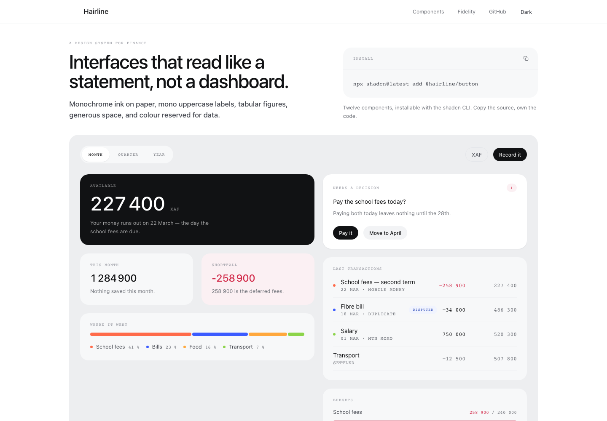
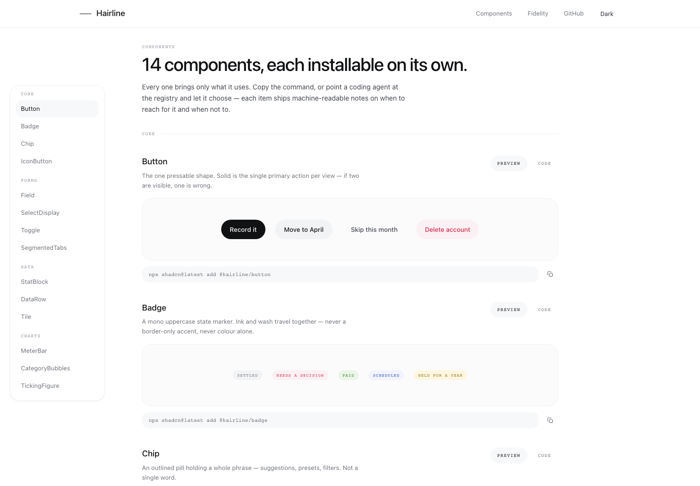
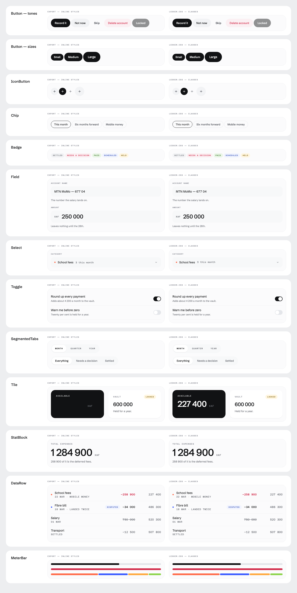

# Hairline

**A calm design system and component library for finance.** Monochrome ink on paper,
mono uppercase labels, tabular figures, generous space, and colour reserved for data.

Named for its own rule: *structure by hairline, not by box.*



Hairline is a finance-specialised component library — bank and fintech dashboards,
expense tracking, invoicing and ledgers, with trading as a supported corner —
installable with the shadcn CLI and designed to be consumed by coding agents as much as
by people.

> **Status: in progress.** Fifteen registry items are live and installable. The wider
> finance catalogue, the agent-first docs layer and the `usehairline.com` domain are
> being built. See [the roadmap](#roadmap).

## Install

Add the registry to your `components.json`:

```json
{
  "registries": {
    "@hairline": "https://usehairline.com/r/{name}.json"
  }
}
```

Then add what you need:

```sh
npx shadcn@latest add @hairline/button
npx shadcn@latest add @hairline/data-row @hairline/stat-block @hairline/tile
```

Components are copied into your project as source. You own the code.

## Why it exists

Most component libraries are either generic — a button, a card, a dialog — or
decoration-first, selling with glow, gradients and lift. Finance interfaces need
neither. They need a figure you can trust at a glance, columns that line up, colour
that means something, and restraint.

That's the gap Hairline aims at: **a large catalogue with a bank's restraint**, where
the delight comes from data motion — figures counting, meters filling, a spend field
resolving — rather than glitter.

Three rules do most of the work:

- **Colour is data.** Chrome is monochrome. An accent means a category, a series or a
  status — never decoration, never a border-only accent. Semantic colours travel as an
  ink and a wash together.
- **Figures are tabular.** Every number in a table is mono, tabular and slashed-zero, so
  columns align and a figure never jitters as it changes.
- **Structure by hairline.** One-pixel rules, no vertical rules, no zebra striping, no
  cell borders. Cards take a fill, not a border.

## The components



| Group | Components |
| --- | --- |
| Core | `Button` `IconButton` `Chip` `Badge` |
| Forms | `Field` `SelectDisplay` `Toggle` `SegmentedTabs` |
| Data | `Tile` `StatBlock` `DataRow` |
| Charts | `MeterBar` `CategoryBubbles` `TickingFigure` |

Each ships machine-readable notes — what it's for, when *not* to use it, and what to use
instead — so a coding agent can pick correctly without reading prose.

## Packages

| Package | What it is |
| --- | --- |
| [`@hairline/tokens`](packages/tokens) | The single source of truth. TypeScript tokens generated into CSS custom properties, a Tailwind v4 `@theme`, a dark palette, and a JavaScript object for React Native. |
| [`@hairline/ds`](packages/hairline) | The original framework-free layer: `hairline.css` with 76 real classes, plus 12 React and 12 React Native components. |
| [`apps/docs`](apps/docs) | The docs site and the registry it serves. |

## How it fits together

```
packages/tokens/src/*.ts              the single source of truth
        │
        ├─→ tokens.generated.css      :root custom properties  (the 106-property contract)
        ├─→ theme.generated.css       Tailwind v4 @theme + 21 type utilities
        ├─→ dark.generated.css        the dark palette
        ├─→ tokens.json               the machine-readable table
        └─→ dist/index.js             the React Native theme
```

Everything is generated from one place. React Native has no `var()`, no `font`
shorthand, `letterSpacing` in px rather than em and `lineHeight` in px rather than a
ratio — without generation, the platforms drift apart within a month.

**Never hand-edit a `*.generated.css`.** Edit `packages/tokens/src/*.ts` and rebuild.

## Where it came from

Extracted from the mockups for **Moni**, a personal-finance app for Cameroon (XAF,
mobile money, an on-chain savings vault, an assistant called Kima). The original Claude
Design export is preserved untouched in
[`packages/hairline/reference/`](packages/hairline/reference).

Read [`DESIGN.md`](packages/hairline/skill/DESIGN.md) for the design spec.

## Verified, not asserted



Six checks run on every commit:

| Check | What it guarantees |
| --- | --- |
| `check-tokens` | All 106 of the export's custom properties reproduced exactly. Additions allowed; changes are not. |
| `check-theme` | No colour literals in `@theme`, every token bridged, dark re-points the whole scale. |
| `check-tailwind` | The theme actually compiles and 22 utilities emit the right declarations — including that `text-strong` is a colour, not a font size, and `p-4` is still 16px. |
| `check-visual` | Every component pixel-diffed against the original export at two widths. Deliberate differences are allowlisted **with a bound**, so a fix can't mask a later regression. |
| `check-port` | The Tailwind components diffed against the original class layer, in light and dark. |
| `check-native` | The React Native unit conversions asserted. |

## Working on it

```sh
pnpm install
pnpm build     # tokens → css → js → registry → checks
pnpm check     # all six checks
pnpm dev       # the docs site on :3333
```

## Roadmap

1. **The finance catalogue** — money primitives, transactions, accounts, budgets,
   payments, KYC, invoicing, and whole-page blocks.
2. **Agent-first docs** — `llms.txt`, a rule registry, per-component `.md` routes, MCP
   discovery, and an ESLint plugin that enforces the design rules where advice fails.
3. **An expressive tier** — opt-in components that may use gloss and motion, for the
   surfaces that need to sell, kept separate so the calm core stays trustworthy.
4. **The 3D category lens** the bubble field opens into.

## Licence

None yet — all rights reserved by default. A `LICENSE` file will land before the
registry is published.
