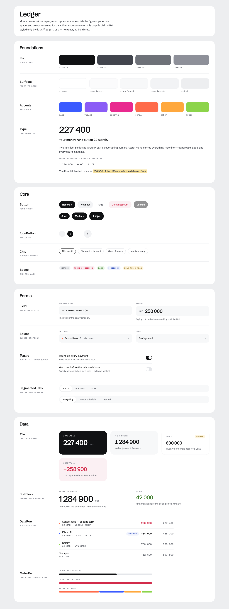

# Hairline

**A calm design system and component library for finance.** Monochrome ink on paper,
mono uppercase labels, tabular figures, generous space, and colour reserved for data.

Hairline is being grown into a finance-specialised component library — bank and fintech
dashboards, expense tracking, invoicing and hairlines, with trading as a supported corner —
installable with the shadcn CLI and designed to be consumed by coding agents as much as
by people.

> **Status: in progress.** The design system and its 12 components are stable and
> published. The shadcn registry, the docs site at `usehairline.com` and the wider
> component catalogue are being built. See [the roadmap](#roadmap).



## Packages

| Package | What it is |
| --- | --- |
| [`@hairline/tokens`](packages/tokens) | The single source of truth. Hand-authored TypeScript tokens generated into CSS custom properties, a Tailwind v4 theme, and a JavaScript object for React Native. |
| [`hairline`](packages/hairline) | The current library: a framework-free stylesheet (`hairline.css`), 12 React web components, and the same 12 on React Native. |

## Why it exists

Most component libraries are either generic (a button, a card, a dialog) or
decoration-first (glow, gradient, lift). Finance interfaces need neither. They need a
figure you can trust at a glance, columns that line up, colour that means something, and
restraint — which is exactly what 2026 fintech design guidance describes and what this
system was designed around from the start.

So Hairline aims at the gap: **a large catalogue with a bank's restraint**, where the
delight comes from data motion — figures counting, sparklines drawing, meters filling —
rather than glitter.

## Where it came from

Extracted from the mockups for **Moni**, a personal-finance app for Cameroon (XAF, mobile
money, an on-chain savings vault, an assistant called Kima). The original Claude Design
export is preserved untouched in [`packages/hairline/reference/`](packages/hairline/reference),
and a build-time check reproduces its 106 design tokens exactly — additions are allowed,
changes are not.

Read [`DESIGN.md`](packages/hairline/skill/DESIGN.md) for the design spec. It answers
most questions before you ask them, and it is the best thing in this repo.

## Quick start

```sh
pnpm install
pnpm build     # tokens → css → js → checks → skill bundle
pnpm check     # typecheck + token drift + native adapter
```

Consuming it today, before the registry ships:

```sh
npm install github:Hubertformin/hairline
```

```tsx
import { Tile, StatBlock } from '@hairline/ds';
import '@hairline/ds/hairline.css';
```

Full usage, component tables and the token reference:
[`packages/hairline/README.md`](packages/hairline/README.md).

## Roadmap

1. **Tailwind v4 bridge** — generate a `@theme` block from the same tokens, so
   `--ink-1` becomes `bg-ink-1` and the library speaks the language shadcn users and
   agents already know.
2. **shadcn registry** at `usehairline.com` — `npx shadcn add @hairline/<name>`.
3. **Agent-first docs** — `llms.txt`, per-component machine-readable usage contracts,
   MCP discovery, and an ESLint plugin that enforces the design rules where advice fails.
4. **The catalogue** — money primitives, transactions, accounts, charts, budgets,
   payments, KYC, invoicing, and whole-page blocks.
5. **Dark theme**, shipping alongside the light one.

## Licence

None yet — all rights reserved by default. A `LICENSE` file will land before the registry
is published.
